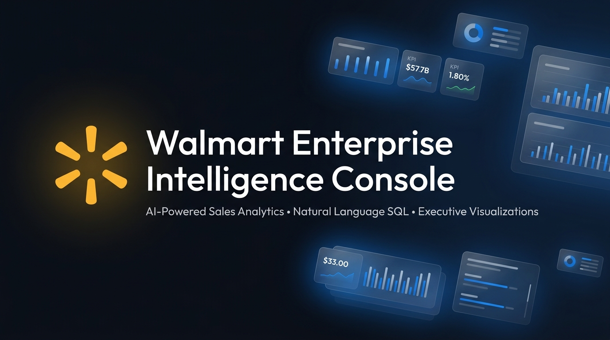

<p align="center">
  
</p>

<h1 align="center">✴ Walmart Enterprise Intelligence Console</h1>

<p align="center">
  <strong>AI-Powered Sales Analytics Platform — Natural Language to SQL, Plotly Visualizations, and Executive Briefings</strong>
</p>

<p align="center">
  
  
  
  
  
  
</p>

<p align="center">
  <a href="#-features">Features</a> •
  <a href="#-architecture">Architecture</a> •
  <a href="#-quick-start">Quick Start</a> •
  <a href="#-data-dictionary">Data Dictionary</a> •
  <a href="#-deployment">Deployment</a> •
  <a href="#-project-structure">Project Structure</a>
</p>

---

## 🎯 Overview

The **Walmart Enterprise Intelligence Console** is a production-grade, boardroom-ready analytics platform built to transform raw retail sales data into actionable executive insights — using nothing but natural language.

Ask a business question in plain English. The platform translates it into optimized SQL, executes against a 421,570-record data warehouse, generates interactive Plotly visualizations, and delivers an AI-powered executive briefing — all in under 2 seconds.

### What Makes This Special

| Capability | Description |
|:---|:---|
| **Natural Language SQL Engine** | Ask questions like *"Top 10 stores by revenue"* — the AI writes and executes the SQL for you |
| **Enterprise-Grade Visualizations** | Plotly-powered bar charts, line trends, donut charts, and scatter plots with Walmart brand theming |
| **Executive Popup Modals** | Full-screen results modals with KPI metrics, charts, data tables, and CSV export |
| **Preset Question Sidebar** | One-click access to 11 categorized "Most Asked" executive questions |
| **Dual API Key Failover** | Automatic fallback to a secondary Groq API key if the primary key hits rate limits |
| **Clean Text Sanitizer** | LLM output is stripped of all markdown artifacts (asterisks, LaTeX) for pristine executive reports |

---

## ✨ Features

### 1. Intelligence Console (Natural Language → SQL → Charts → Modal)

The core feature. Type any business question and the system:

1. **Generates SQL** — Uses GPT-OSS 120B via Groq LPU to convert natural language to optimized SQLite queries
2. **Executes Query** — Runs against the 45-store, 81-department, 2-year Walmart sales data warehouse
3. **Renders Visualization** — Auto-detects the best chart type (Bar, Line, Donut, Scatter) or lets you choose
4. **Delivers Executive Briefing** — AI-generated summary with specific numbers, percentages, and strategic recommendations
5. **Opens Popup Modal** — Full-screen deep-dive with KPI cards, interactive charts, formatted data tables, and CSV export

### 2. Interactive Data Explorer

A filter-driven exploration interface with:
- **Multi-store selection** — Filter by any combination of 45 stores
- **Department drill-down** — Isolate specific department performance
- **Holiday week toggle** — Compare holiday vs. non-holiday patterns
- **Dual-axis Plotly chart** — Weekly Sales overlaid with Fuel Price trends

### 3. Audit Schema & Data Dictionary

A compliance-ready tab with:
- Complete column definitions, data types, and nullability
- Verification status panel (421,570 verified records, zero nulls in financial keys)
- System architecture documentation (Streamlit + Plotly + Groq LPU + SQLAlchemy)

### 4. Sidebar — Most Asked Questions (One-Click Direct Access)

The sidebar provides **11 pre-built executive questions** organized into 4 categories. Click any question to **instantly execute** it — no typing required. The query runs immediately, generates SQL, renders the chart, and opens the executive briefing.

#### 💰 Financial & Revenue
| # | Question | What It Reveals |
|:---:|:---|:---|
| 1 | **Top 10 stores by revenue** | Highest-performing store locations ranked by total weekly revenue |
| 2 | **Monthly sales trend** | Month-over-month revenue trajectory across all 45 stores |
| 3 | **Top 5 departments by sales** | Best-performing merchandise categories by revenue |

#### 🏬 Fleet & Store Types
| # | Question | What It Reveals |
|:---:|:---|:---|
| 4 | **Sales by Store Type A/B/C** | Average weekly sales breakdown by store classification |
| 5 | **Stores exceeding $200M** | High-volume locations surpassing the $200M revenue threshold |
| 6 | **Store size vs revenue** | Correlation between physical store area and sales performance |

#### 📊 Macro & External Drivers
| # | Question | What It Reveals |
|:---:|:---|:---|
| 7 | **Fuel Price Impact** | How regional fuel costs affect weekly consumer spending |
| 8 | **CPI vs Weekly Sales** | Relationship between inflation index and store revenue |
| 9 | **Unemployment Effect** | Impact of regional unemployment rates on sales volume |

#### 🎄 Holiday & Seasonality
| # | Question | What It Reveals |
|:---:|:---|:---|
| 10 | **Holiday vs Non-Holiday** | Revenue comparison between holiday and regular weeks |
| 11 | **All-time highest sales week** | Peak revenue week in the entire 2-year dataset |

> **How it works:** Click any sidebar button → the question auto-fills → SQL is generated and executed → Plotly chart renders → Executive briefing appears — all in one click.

---

## 🏗 Architecture

```
┌─────────────────────────────────────────────────────────────────┐
│                    PRESENTATION LAYER                            │
│  ┌───────────────┐  ┌──────────────┐  ┌───────────────────────┐ │
│  │  Streamlit UI │  │ Plotly Charts │  │ Executive Popup Modal │ │
│  │  (Dark Theme) │  │  (4 Types)   │  │  (KPIs + Charts +     │ │
│  │  + Custom CSS │  │  Bar/Line/   │  │   Data Table + CSV)   │ │
│  │               │  │  Donut/Scat  │  │                       │ │
│  └───────┬───────┘  └──────┬───────┘  └───────────┬───────────┘ │
└──────────┼─────────────────┼──────────────────────┼─────────────┘
           │                 │                      │
┌──────────┼─────────────────┼──────────────────────┼─────────────┐
│          │         INTELLIGENCE LAYER              │             │
│  ┌───────▼───────────────────────────────────────────────────┐  │
│  │              Groq LPU — GPT-OSS 120B                      │  │
│  │  ┌─────────────────┐    ┌──────────────────────────────┐  │  │
│  │  │ NL → SQL Engine │    │ Executive Briefing Generator │  │  │
│  │  │ (Schema-Aware)  │    │ (Clean Text Sanitizer)       │  │  │
│  │  └─────────────────┘    └──────────────────────────────┘  │  │
│  │  ┌─────────────────────────────────────────────────────┐  │  │
│  │  │     Dual API Key Failover (Primary + Fallback)      │  │  │
│  │  └─────────────────────────────────────────────────────┘  │  │
│  └───────────────────────────────────────────────────────────┘  │
└─────────────────────────────────┬───────────────────────────────┘
                                  │
┌─────────────────────────────────┼───────────────────────────────┐
│                         DATA LAYER                               │
│  ┌──────────────────────────────▼──────────────────────────────┐ │
│  │                  SQLite Data Warehouse                       │ │
│  │                  walmartsales.db (43.7 MB)                   │ │
│  │                                                              │ │
│  │  Table: walmart_sales                                        │ │
│  │  ├── 421,570 weekly sales records                            │ │
│  │  ├── 45 stores × 81 departments × 143 weeks                 │ │
│  │  ├── Financial: Weekly_Sales, MarkDown1-5                    │ │
│  │  ├── External: CPI, Fuel_Price, Unemployment, Temperature   │ │
│  │  └── Categorical: Type (A/B/C), IsHoliday, Store, Dept      │ │
│  └─────────────────────────────────────────────────────────────┘ │
└──────────────────────────────────────────────────────────────────┘
```

---

## 🚀 Quick Start

### Prerequisites

- Python 3.10+
- A [Groq API key](https://console.groq.com) (free tier works)

### 1. Clone the Repository

```bash
git clone https://github.com/HarshSWE6/Walmart-ai-based-analysis.git
cd Walmart-ai-based-analysis
```

### 2. Install Dependencies

```bash
pip install -r requirements.txt
```

### 3. Configure API Keys

Create `.streamlit/secrets.toml` (this file is git-ignored for security):

```toml
GROQ_API_KEY = "gsk_your_primary_key_here"
GROQ_API_KEY_FALLBACK = "gsk_your_backup_key_here"   # optional
```

### 4. Launch the Application

```bash
streamlit run app.py
```

The app opens at **http://localhost:8501** — you'll see the full Enterprise Intelligence Console with KPI dashboard, preset questions, and the NL query interface.

---

## 🗄 Data Dictionary

The platform runs on a single consolidated SQLite table: **`walmart_sales`**

| Column | Type | Nullable | Description |
|:---|:---|:---:|:---|
| `Store` | INTEGER | No | Unique store ID (1–45) |
| `Dept` | INTEGER | No | Department identifier (1–99) |
| `Date` | TEXT | No | Week-ending date (YYYY-MM-DD format) |
| `Weekly_Sales` | REAL | No | Gross weekly revenue for store-department combination |
| `IsHoliday` | INTEGER | No | Holiday flag (1 = Super Bowl, Labor Day, Thanksgiving, Christmas) |
| `Temperature` | REAL | Yes | Average regional temperature (°F) |
| `Fuel_Price` | REAL | Yes | Regional fuel cost ($/gallon) |
| `MarkDown1–5` | REAL | Yes | Anonymized promotional markdown values |
| `CPI` | REAL | Yes | Consumer Price Index |
| `Unemployment` | REAL | Yes | Regional unemployment rate (%) |
| `Type` | TEXT | No | Store classification (A = high volume, B = mid, C = small) |
| `Size` | INTEGER | No | Store area in square feet |
| `Year` | INTEGER | No | Extracted year from Date |
| `Month` | INTEGER | No | Extracted month (1–12) |
| `Month_Name` | TEXT | No | Full month name (January–December) |
| `Quarter` | TEXT | No | Fiscal quarter (Q1–Q4) |
| `Week` | INTEGER | No | ISO week number |

### Key Statistics

| Metric | Value |
|:---|:---|
| Total Records | 421,570 |
| Stores Tracked | 45 |
| Departments Covered | 81 |
| Date Range | Feb 2010 – Oct 2012 |
| Gross Revenue (Total) | $6.74B |
| Average Weekly Sales | $15,981 per store-department |

---

## 🔧 Tech Stack

| Layer | Technology | Purpose |
|:---|:---|:---|
| **Frontend** | Streamlit 1.35+ | Interactive web UI with custom CSS theming |
| **Styling** | Custom CSS (570+ lines) | Enterprise dark theme with Walmart brand colors, glassmorphism, micro-animations |
| **Charts** | Plotly Express + Graph Objects | 4 chart types (Bar, Line, Donut, Scatter) with Walmart brand color palette |
| **AI/LLM** | Groq LPU — GPT-OSS 120B | Natural language → SQL translation + Executive briefing generation |
| **Database** | SQLite 3 + SQLAlchemy | Lightweight embedded SQL engine — zero server configuration |
| **Data Processing** | Pandas + NumPy | DataFrame operations, aggregations, and formatting |
| **Fonts** | Plus Jakarta Sans, Outfit, JetBrains Mono | Typography for headings, body text, and code/monospace elements |

---

## 📁 Project Structure

```
walmart-ai-based-analysis/
├── app.py                          # Main Streamlit application (1,372 lines)
├── requirements.txt                # Python dependencies
├── walmartsales.db                 # SQLite data warehouse (43.7 MB, 421K records)
├── assets/
│   └── banner.jpg                  # README hero banner image
├── .streamlit/
│   ├── config.toml                 # Streamlit theme configuration (Walmart dark theme)
│   └── secrets.toml                # API keys (git-ignored)
├── .gitignore                      # Git exclusion rules
├── data/                           # Raw source data files
│   ├── stores.csv                  # Store metadata (Type, Size)
│   ├── features.csv                # External features (CPI, Fuel, Temperature)
│   └── train.csv                   # Weekly sales training data
├── walmart 01_Data_Merging_Cleaning.ipynb   # Data pipeline: merge & clean
├── walmart 02_Data_Cleaning.ipynb.ipynb     # Data pipeline: advanced cleaning
├── walmart 03_EDA.ipynb                     # Exploratory data analysis
├── text_to_sql.ipynb               # NL-to-SQL prototyping notebook
└── app.ipynb                       # Application prototyping notebook
```

---

## ☁️ Deployment

### Streamlit Community Cloud (Recommended)

1. Push your repository to GitHub
2. Go to [share.streamlit.io](https://share.streamlit.io)
3. Connect your GitHub repository: `HarshSWE6/Walmart-ai-based-analysis`
4. Set the main file path to `app.py`
5. In **Advanced Settings → Secrets**, add:
   ```toml
   GROQ_API_KEY = "gsk_your_key_here"
   GROQ_API_KEY_FALLBACK = "gsk_your_backup_key"
   ```
6. Click **Deploy** — your app will be live in ~60 seconds

### Other Platforms

The app is compatible with any platform that supports Streamlit:
- **Railway** — `streamlit run app.py --server.port $PORT`
- **Render** — Set build command to `pip install -r requirements.txt` and start command to `streamlit run app.py`
- **Docker** — Add a `Dockerfile` with `EXPOSE 8501` and the streamlit run command

---

## 🔐 Security

- API keys are stored exclusively in `.streamlit/secrets.toml` (git-ignored)
- Dual-key failover prevents service interruption from rate-limiting
- No user data is persisted — all queries are session-scoped
- Database is read-only; no write operations are permitted via the UI

---

## 📊 Jupyter Notebooks — Data Pipeline

The project includes the complete data engineering pipeline:

| Notebook | Purpose |
|:---|:---|
| `walmart 01_Data_Merging_Cleaning.ipynb` | Merges `stores.csv`, `features.csv`, and `train.csv` into a unified dataset |
| `walmart 02_Data_Cleaning.ipynb.ipynb` | Handles missing values, type conversions, and feature engineering (Year, Month, Quarter, Week) |
| `walmart 03_EDA.ipynb` | Exploratory Data Analysis — distributions, correlations, seasonal patterns, store type comparisons |
| `text_to_sql.ipynb` | Prototyping the NL-to-SQL pipeline with Groq API |

---

## 🤝 Contributing

1. Fork the repository
2. Create a feature branch: `git checkout -b feature/amazing-feature`
3. Commit your changes: `git commit -m "Add amazing feature"`
4. Push to the branch: `git push origin feature/amazing-feature`
5. Open a Pull Request

---

## 📄 License

This project is licensed under the MIT License. See the [LICENSE](LICENSE) file for details.

---

<p align="center">
  <strong>Built with ❤️ for Walmart Enterprise Analytics</strong><br/>
  <sub>Streamlit • Plotly • Groq LPU • SQLite • Python</sub>
</p>
